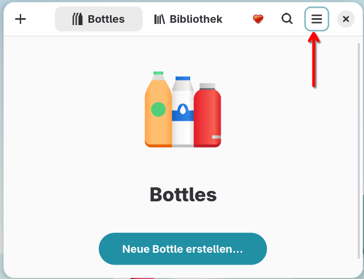
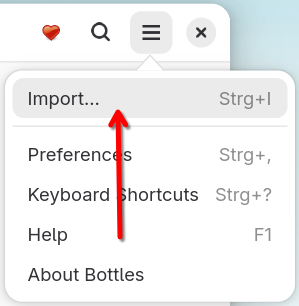
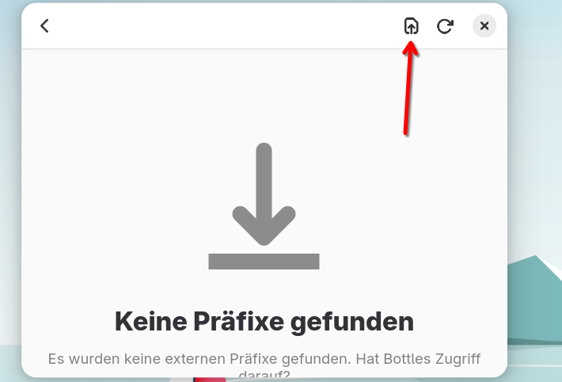
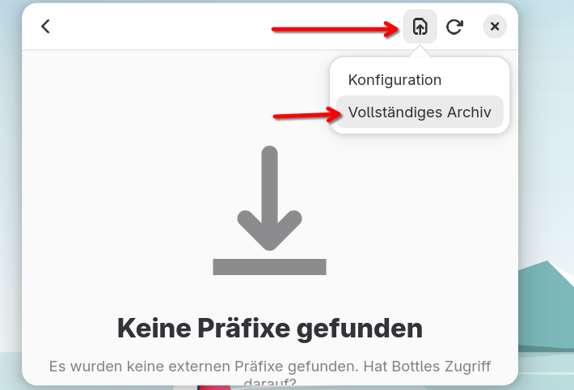
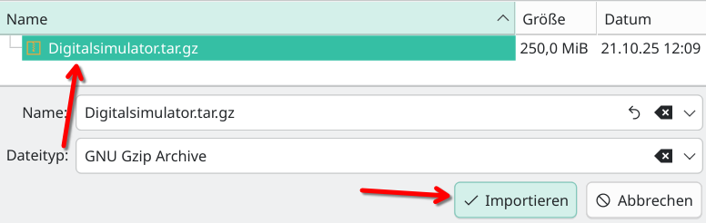
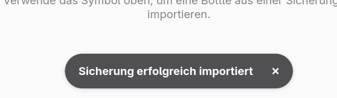
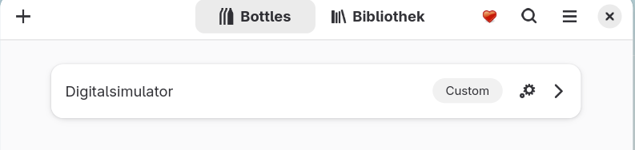
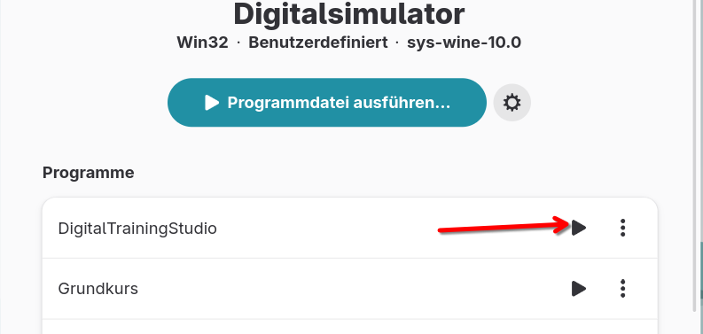

1. Installiere bottles https://usebottles.com/
2. Importiere [Digitalsimulator.tar.gz](https://github.com/gamebeaker/Bottles_wrapper_Digitalsimulator/releases/download/1.0.0/Digitalsimulator.tar.gz)

